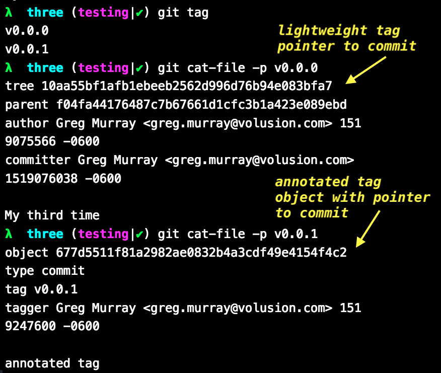

# Tagging

```bash
git tag --list   # also -l or no switch
echo "Copyright (c) 2021 All rights un-reserved" > LICENSE
git status
git add LICENSE
git commit -m "Added license"

# annotated tag
git tag -a v0.0.1 -m "0.0.1"
git tag
git cat-file -p v0.0.1

echo "### Git Tags - Annotated and Lightweight" > TAGGING.md
git add TAGGING.md    # Could you do commit -am here to combine these 2 lines?
git commit -m "Added tagging documentation"
git tag v0.0.2
git tag
git cat-file -p v0.0.2

# What's the difference between an annotated and lightweight tag?
#   lightweight tag similar to a branch, a pointer to a commit.
#     What's the difference between a tag and a branch?
#       Branches move, tags do not.

# checking out a tag
git checkout v0.0.1
ls   # where is TAGGING.md?

git checkout master
git checkout -b bugfix/correct-license v0.0.1

```


