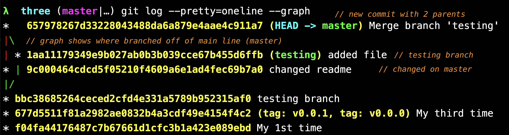

# Merging

What's the difference between?

* Fast-forward merge
* Merge commit/recursive merge.

Checkout target and then merge from source branch into target.

```bash
feature/add-field> git checkout main
main> git merge feature/add-field
```



```bash
git log --oneline --decorate --graph --all
```

Show latest commits for each branch

```bash
git branch -v
```

## Merge Conflicts

```bash

git merge feature/add-field
# Auto-merging index.html
# CONFLICT (content): Merge conflict in index.html
# Automatic merge failed; fix conflicts and then commit the result.

# tell Git conflict has been resolved.
git add #filename
git commit
```

Make sure your [editor is configured to wait](Git-Configuration)

### Cleanup

```bash
git branch --merged
git branch --no-merged

git branch -d feature/add-field
```

---

← [prev](./Lab-3-Let-us-branch-out.md) | [next](./Lab-3.5-Remote-Branches.md) → | 🏠 [home](./README.md)
