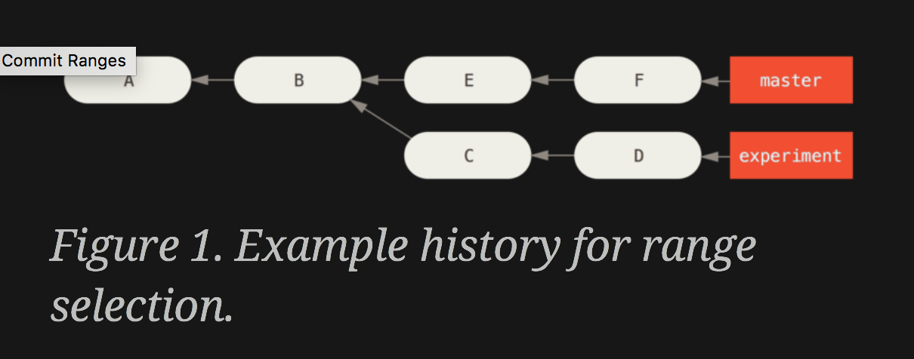

### show me the-money

    git log --graph --decorate --oneline
    git show # sha
    git show # branch
    git show HEAD
    git show   # defaults to HEAD
    git show --pretty="" --name-only #sha1

    # what's the difference between git show and cat-file?
    git cat-file -p #sha

    # reverse and get the sha of a branch
    git rev-parse HEAD

### Ancestry relative to HEAD

    git show HEAD
    git show HEAD^  # parent commit of HEAD

    # on windows need to escape ^
    git show HEAD^^
    git show "HEAD^"

    git show HEAD^^ # grandparent of HEAD
    git show HEAD~2  # go to HEAD then move back 2 commits
    git show HEAD~2^2 # for merge commits, refers to the 2nd parent
    git show HEAD@{"1 month ago"}
    git show HEAD@{2.weeks.ago}
    git diff HEAD HEAD~2

Are these equivalent?

   git show HEAD^
   git show HEAD~

### ls-tree - snapshot of all files at time of a given commit

    # a tree of BLOBs
    git ls-tree -r HEAD # or sha1

    # only show file names of the snapshot
    git ls-tree --name-only -r HEAD # or sha1

### diff-tree - only files in commit

    git diff-tree --name-only -r HEAD # or sha1

### .. dot ranges

“What work is on this branch that I haven’t yet merged into my main branch?”

    git log HEAD~4..HEAD^ --oneline # show commits between parent of head and 4 commits from HEAD

    # a..b  what's in b that is not in a.
    git log master..experiment # what's new in experiment that's not in master
    git log experiment..master --oneline # show new commits in master not in feature
    # exclude merges, shows new commits in origin/master
    git log --no-merges experiment..origin/master

    git log master..experiment
    D
    C

    git log experiment..master
    F
    E

    # commits in HEAD not in origin, iow, what will be pushed to remote
    # Like a Right Outer Join where origin/master is null
    git log origin/master..HEAD

    # defaults to HEAD if omitted
    git log origin/master..

3+ branches
“to see all commits that are reachable from refA or refB but not from refC, you can use either of:”

    git log refA refB ^refC
    git log refA refB --not refC

### Triple Dot ...
“what is in master or experiment but not any common references”

    # like a union of left and right outer joins
    git log master...experiment
    F
    E
    D
    C

    # which is left and which is right?
    git log --left-right master...experiment
    < F
    < E
    > D
    > C

    # what's changed in experiment only
    git diff master...experiment
    D
    C

[Stackoverflow: differences-between-double-dot-and-triple-dot](https://stackoverflow.com/questions/462974/what-are-the-differences-between-double-dot-and-triple-dot-in-git-com)

[Stackoverflow: differences-between-double-dot-and-triple-dot-in-git-dif](https://stackoverflow.com/questions/7251477/what-are-the-differences-between-double-dot-and-triple-dot-in-git-dif)

### Where have you been?
[RefLog](https://git-scm.com/book/en/v2/Git-Tools-Revision-Selection) :: _shell history_

    git reflog
    git log -g
    git log -g --abbrev-commit --oneline

    git show HEAD@{2}
    git show master@{yesterday}

What will reflog show after cloning a repo?

### References
[How to list files in a commit?](https://stackoverflow.com/questions/424071/how-to-list-all-the-files-in-a-commit)