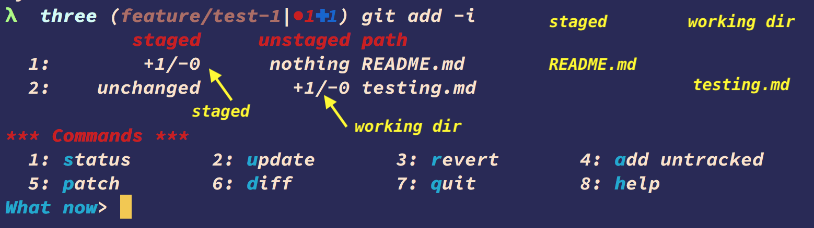
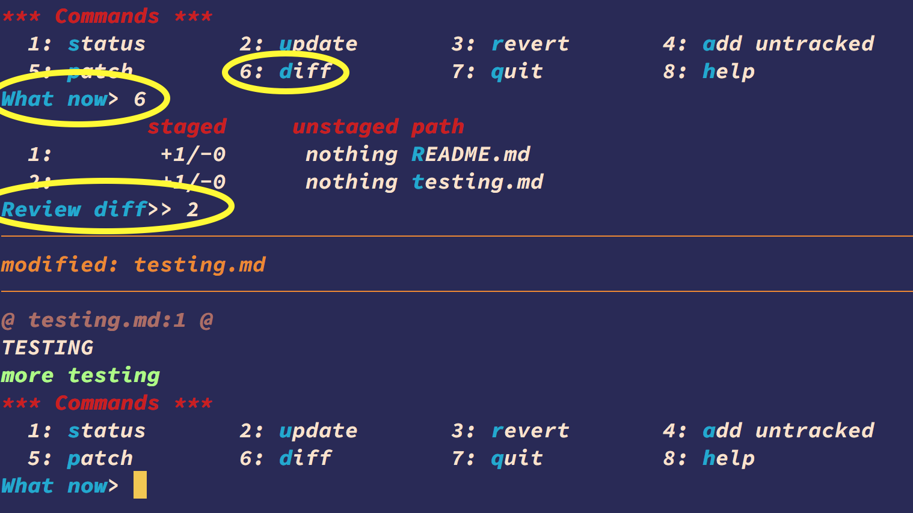

# Interactive staging

```bash
echo "new line" >> README.md
git add README.md
echo "new line" >> testing.md
git status

git add -i
```



## diff

```bash
git diff --cached
```



## patch -p

First make multiple edits in a file

```bash
# wd -> staging
git add --patch   # -p

# wd <- staging
git reset -p                  # or: git restore --staged -p

# undo working dir
git checkout -p               # or: git restore -p

# stash <- wd
git stash push -p
```

---

← [prev](./Lab-7.1-Showing-Commits.md) | [next](./Lab-7.3-The-Stash.md) → | 🏠 [home](./README.md)
