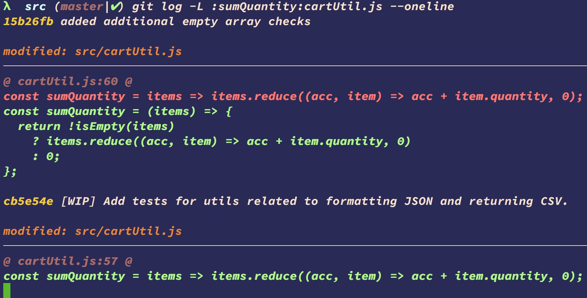

# Searching

```bash
git grep Object.assign

# --count or summary count by file
git grep -c Object.assign

git grep -c lodash

git grep -p --break --heading Object.assign

# search in a specific branch or tag
git grep -p --break --heading -p Object.assign 0.0.110

git log -S Object.assign --oneline

# :function name:file
git log -L :sumQuantity:cartUtil.js --oneline

```



---

← [prev](./Lab-7.4-Worktrees.md) | [next](./Lab-7.6-Rewriting-History.md) → | 🏠 [home](./README.md)
