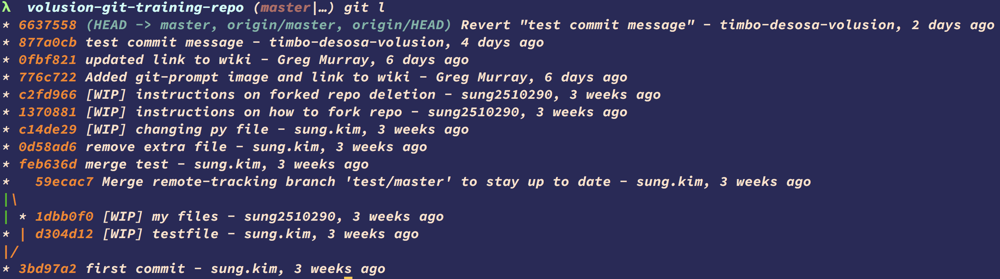
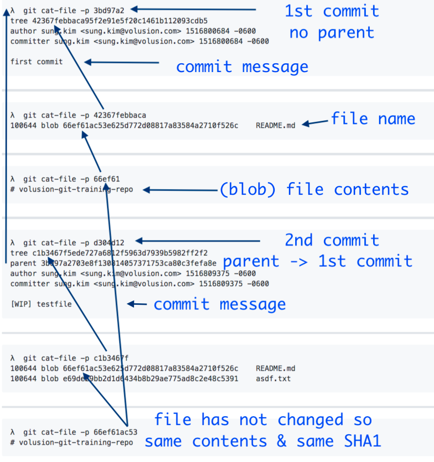
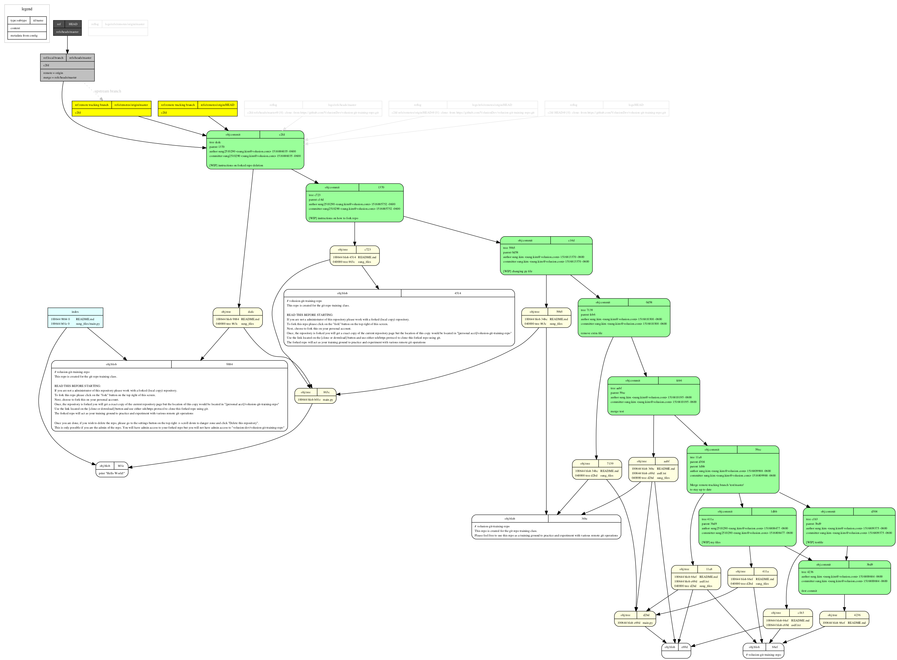

# What's in a Commit?

A commit object contains:
- A **tree** — a snapshot of every file in the repo at that point in time
- A **parent** — pointer to the previous commit (merge commits have two parents; the initial commit has none)
- **Author** — who wrote the change and when
- **Committer** — who applied the change and when (usually the same as author)
- **Message** — description of the change

You can inspect any commit with `git cat-file -p <sha>`.

Tracing a commit object reveals the tree, blob, and parent structure:

Generated from this repo with [git-draw](https://github.com/sensorflo/git-draw)

---

← [prev](./Lab-1-There-and-back-again.md) | [next](./Lab-2-Send-in-the-Clones.md) → | 🏠 [home](./README.md)
