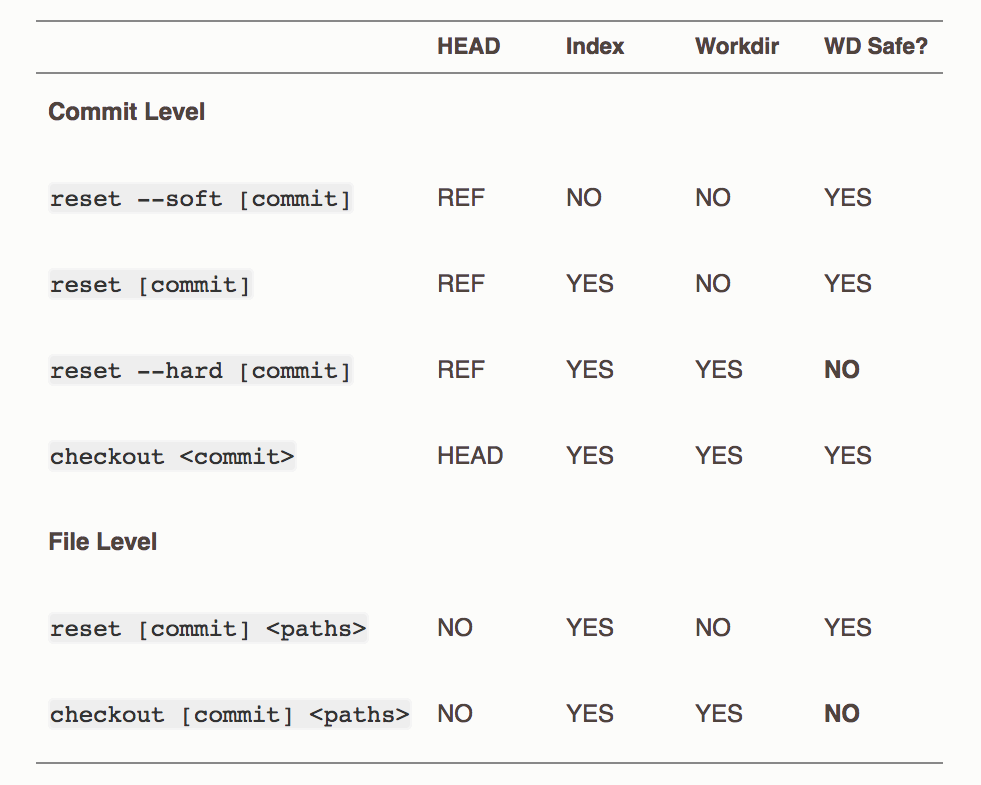

## [Reset demystified](https://git-scm.com/book/en/v2/Git-Tools-Reset-Demystified)

> The “HEAD” column reads “REF” if that command moves the reference (branch) that HEAD points to, and “HEAD” if it moves HEAD itself.

## Undo changes to working directory

|Working Directory| Staged | Repo | Command
|:----------------|:-------|:-----|:-------|
  M package.json | | | |
| | | | git checkout -- package.json #or

## Unstage file back to working directory
|Working Directory| Staged | Repo | Command
|:----------------|:-------|:-----|:-------|
| |M package.json|||
|M package.json| || git reset package.json

## Reset staging and working directory from Repo.
|Working Directory| Staged | Repo | Command
|:----------------|:-------|:-----|:-------|
|M package.json|M package.json|||
|| || git reset --hard

## Reset staging and working directory to a specific commit, any commits after sha will be unreachable
|Working Directory| Staged | Repo | Command
|:----------------|:-------|:-----|:-------|
|| || git reset --hard # sha1

## Undo completely staged changes
|Working Directory| Staged | Repo | Command
|:----------------|:-------|:-----|:-------|
| |M package.json|||
|| || git checkout HEAD package.json

## Delete new file from staging, but keep in working directory
|Working Directory| Staged | Repo | Command
|:----------------|:-------|:-----|:-------|
| |A new-file.md|||
|?? new-file.md| || git rm --cached package.json

## rename file
|Working Directory| Staged | Repo | Command
|:----------------|:-------|:-----|:-------|
|file.txt ||||
||R file.md || git mv file.txt file.md

---

← [prev](./Three-Main-Areas.md) | [next](./Lab-1-There-and-back-again.md) → | 🏠 [home](./README.md)
